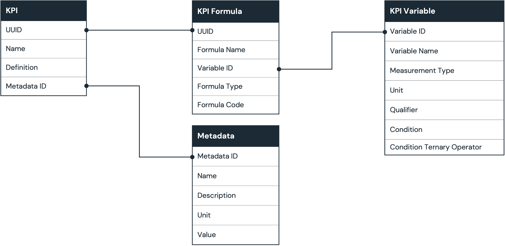
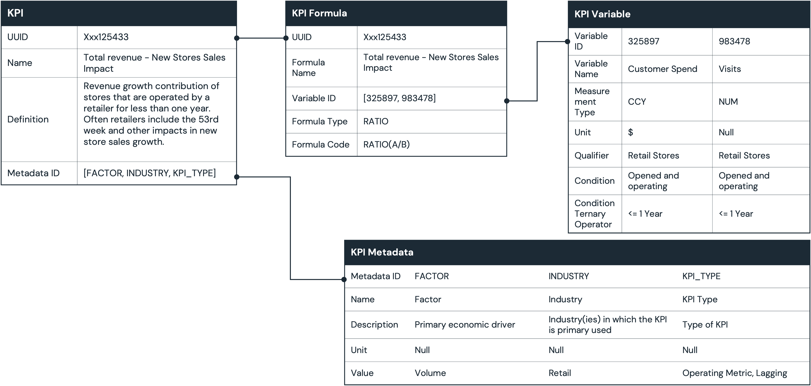

# KPI Schema

### KPI Data
Proposed schema for KPI data (below). This should evolve.  However, the goal in this initial attempt is the design sufficient granularity while keeping the data model lightweight and easy to populate.

#### Formula Table
The ***Formula*** table. Description and choices:
- **UUID**
  - Required: True
  - Description: A unique ID and Primary key to the Formula Table
- **Formula Name**
  - Required: True
  - Description: Name give to the Formula
- **Variable Name**
  - Required: True
  - Description: A unique name given to the variable and Primary key to the Variable Table
- **Formula Type**
  - Required: False
  - Description: The currency or unit. Examples...USD, Stores, FTE's 
  - Choices: CCY = a currency value (USD is the default ccy), NUM = a unit or number, REL = a relative value
- **Formula Code**
  - Required: True
  - Description: A representative formula for the KPI

#### Variable Table
Most of the data is contained in the ***KPI Variable*** table. Description and choices:
- **Variable ID**
  - Required: True
  - Description: A unique ID and Primary key to the KPI Table
- **Variable Name**
  - Required: True
  - Description: Name give to the variable
- **Measurement Type**
  - Required: True
  - Description: 
  - Choices: CCY = a currency value (USD is the default ccy), NUM = a unit or number, REL = a relative value
- **Unit**
  - Required: False
  - Description: The currency or unit. Examples...USD, Stores, FTE's 
- **Qualifier**
  - Required: False
  - Description: Adds context to more narrowly define the variable. For example, if the KPI Variable Name is **stores**, then a Qualifier by be **Retail** to denote tha this KPI refers to retail stores.
- **Condition**
  - Required: False
  - Description: A condition of the variable. For example, a KPI may require a store to  be open and operating for at least 1 year. In such a case, the condition would be **opened and operating**.
- **Condition Ternary Operator**
  - Required: True
  - Description: Pairs with the Condition (above) to scope or limit the condition. Following from the above example, the Condition Ternary Operator would be "<= 1year"
  - Choices: **=**, **>**, **<**, **>=**, **<=**

### KPI Example
An example implementation of the schema is shown below:

More sample data
[Retail Store KPIs](../sample_data/sample_kpi_data.csv "Retail Store KPIs")
### Initial Lists

